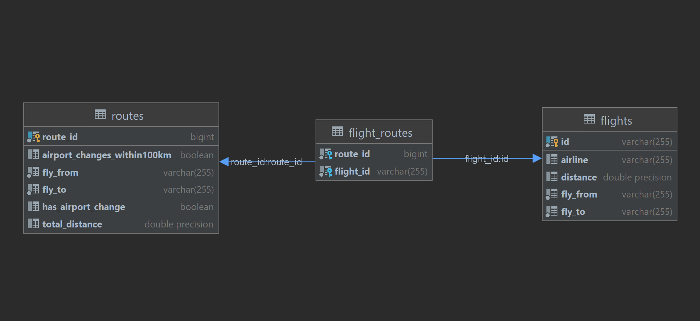

# FlightPlanner-Api

## Description

Implemented the flight search functionality according to the following description:

JSON over HTTP API endpoint that takes as input two IATA airport codes and provides as output a route between these two
airports so that:

- The route consists of at most 4 legs/flights
  (that is, 3 stops/layovers, if going from A->B, a valid route could be A->1->2->3->B, or for example A->1->B etc.)
  and;

- The route is the shortest such route as measured in kilometers of geographical distance.

- Allows changing airports during stops that are within 100km of each other. For example, if going from A->B, a valid
  route could be A->1->2=>3->4->B, where “2=>3” is a change of airports done via ground.

The airport switches are not considered as part of the legs/layover/ hop count, but their distance is reflected in the
final distance calculated for the route.

### Requirements:

- Docker-Compose 1.28
- Gradle 6.8
- Java 11
- Api keys for public aviation databases (Airport-Api-v1 and Tequila)

### Starting(Application has to be run with dev profile):

Step 2: add required apiKeys to application-dev.yml

Step 2: run `docker-compose up` as a terminal command in the root of Project/repository

Step 3:

- run `gradle bootRun --args='--spring.profiles.active=dev' --stacktrace` in the root of repository        
  OR:
- Open in IntelliJ, add 'dev' to active profiles and run ApiApplication

### Swagger API Documentation

[http://localhost:8080/swagger-ui.html](http://localhost:8080/swagger-ui.html)

### Sample Requests

Distance is compared and displayed in 'km'

- Dubai to LosAngeles flights plan with no change of airport -
  http://localhost:8080/api/route/DXB/LAX?connection=NO_AIRPORT_CHANGE
  `{
  "flyFrom": "DXB",
  "flyTo": "LAX",
  "distance": 13749.800000000001,
  "hasAirportChange": false,
  "flights": [
  {
  "flyFrom": "DXB",
  "flyTo": "DOH",
  "distance": 382.7,
  "airline": "QR"
  }, {
  "flyFrom": "DOH",
  "flyTo": "LAX",
  "distance": 13367.1,
  "airline": "QR"
  }
  ]
  }`

- Dubai to LosAngeles flights plan optionally allowing airport change -
  http://localhost:8080/api/route/DXB/LAX?connection=ALLOW_AIRPORT_CHANGE

  `{
  "flyFrom": "DXB",
  "flyTo": "LAX",
  "distance": 13749.800000000001,
  "hasAirportChange": false,
  "flights": [
  {
  "flyFrom": "DXB",
  "flyTo": "DOH",
  "distance": 382.7,
  "airline": "QR"
  }, {
  "flyFrom": "DOH",
  "flyTo": "LAX",
  "distance": 13367.1,
  "airline": "QR"
  }
  ]
  }`

- Dubai to LosAngeles flights plan with a definite change of airport -
  http://localhost:8080/api/route/DXB/LAX?connection=ONLY_AIRPORT_CHANGE
  `{
  "flyFrom": "DXB",
  "flyTo": "LAX",
  "distance": 18508.8,
  "hasAirportChange": true,
  "flights": [
  {
  "flyFrom": "DXB",
  "flyTo": "BOM",
  "distance": 1927.8,
  "airline": "AI"
  }, {
  "flyFrom": "BOM",
  "flyTo": "EWR",
  "distance": 12564.6,
  "airline": "UA"
  }, {
  "flyFrom": "JFK",
  "flyTo": "LAX",
  "distance": 3982.9,
  "airline": "UA"
  }
  ]
  }`

### Possible Next Steps/Things to improve:

- Write More Test Routines for the Application(Currently only 1 MockMVC test)
- Build, test and run with Docker
- Error Logging for Administrator
- More Meaningful Error Message for Consumer
- Input parameters validations
- Api Caching for more responsive API
- More Flexible Design

### Notes:

- Two separate API employed
    - Tequila for flight search
    - Airport-Api for distances b/w airports
- Api works with IATA codes only, ICAO can added later
- Flight searched are saved in local database for faster future access
- Business logic working:
    - If inputs corresponds to persisting direct flight in DB, its assumed to be shortest route
    - if not available , DB is checked for a corresponding route
    - Else Routes are Fetched from Tequila Search Service and persisted in DB for searched also
- Backend has support for more features those currently implemented in the UI
- Current Configuration only for development Environment.